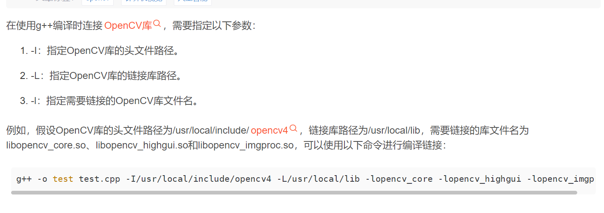

https://www.hhai.cc/thread-135-1-1.html

```c++
`g++ -o test test.cpp
    -I/usr/local/include/opencv4 
    -L/usr/local/lib64 -lopencv_core -lopencv_highgui -lopencv_imgproc -lopencv_videoio`
```

g++编译存视频 需要指定opencv头文件的位置和依赖opencv静态库

